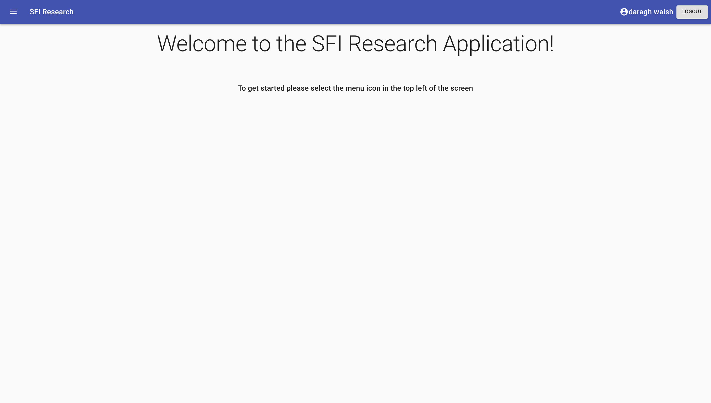
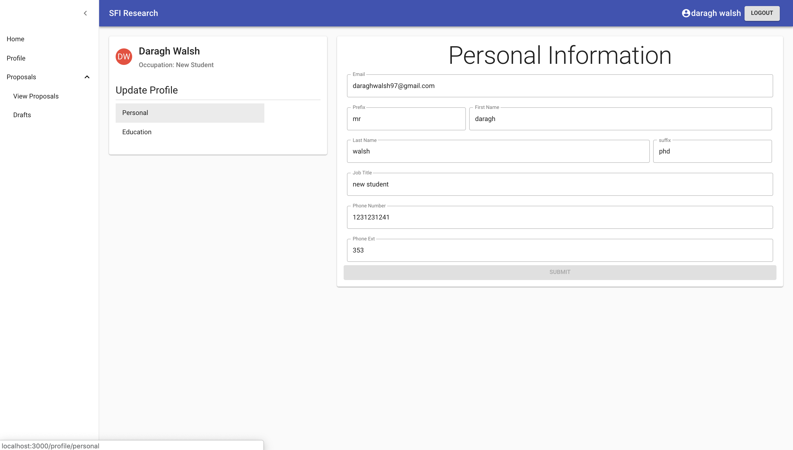
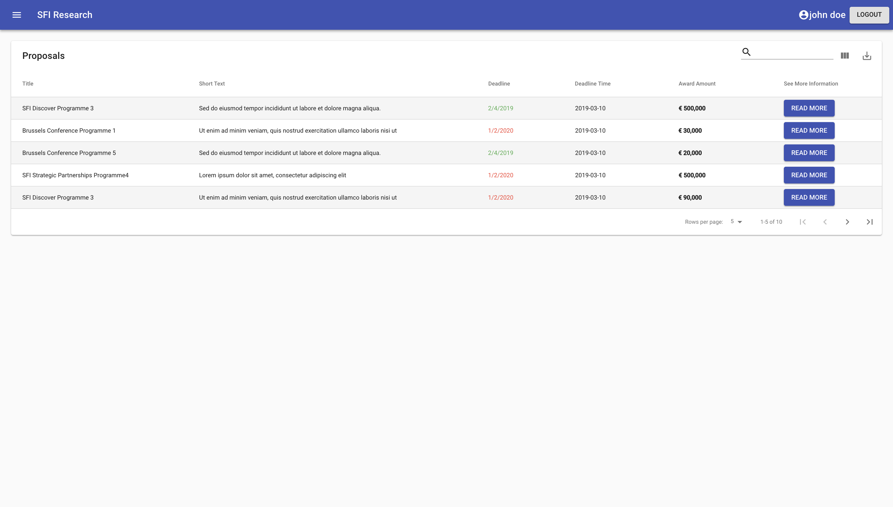

# User Manual

## Unauthorized Landing page

Upon visiting this application for either the first time or as an unauthenticated user you will see the above landing page.

### Register

To register you must complete _all_ fields before the
**submit** button becomes available to you.

You will be registered as a reviewer by default.

### Login

If you completed the register section you will be logged in if successful.

If you already have an account created then please complete the following steps:

1. Select login which will prompt the modal to appear
2. Enter the email and password of your account
3. Submit button will then become available and you can login

Upon successful login the user will be rerouted to the landing page of an **authorized** user.

## Authorized Landing Page

### Logout

Click the logout button in the top right

##

## Sidebar Researcher

Select the burger menu in the top left will open the sidebar menu

To view the various pages in this application, select one of the menu items.

To minimise the menu select the arrow at the top of the sidebar.

For proposals, this is a dropdown menu (see below).

To access one of those routes in proposals you click your option (i.e. _view proposals_)

## Profile Page

### Personal

Here you can update your personal information as you see fit, once you **change** a value in this form.

### Education

With an newly registered account the education page will be a blank form.

You can fill in these values and submit the form.

## Proposals Table Page

Here you will get a brief overview of each proposal, with many different options for the information you wish to see/hide when viewing the overview

### Show/Hide Columns

To show or hide a column in the table select the _3 grey bars_ in the top left of the table beside the search input.

If you select a ticked box it will hide the field in the table.

### Download as CSV

If you select the download icon in the top right of the table it will download the currently displayed proposals.

### Display More Proposals

Select the **rows per page** and set it to either 5 (default), 10, 20 to display more on one page.

### Change Page Of Proposals

- To go to the **next page** of proposals select the right arrow.

- To go **back a page** of proposals select the left arrow.

- To go to the **last page** of proposals select the right arrow with the vertical line.

- To go to the **first page** of proposals select the left arrow with the vertical line.

### Read More

Once you click read more you will be taken to a new page, where you can see more imformation regarding the proposal you selected.

## Proposal Selected Page

Once you select _read more_ from the proposal page you will be taken to here.

You can read more about the proposal and get contact information should you require it.

Once you would like to start your application for this proposal you click **apply now**.

## Application Form

After selecting _apply now_ on the proposal selected page you get taken to this form.

Here you can fill out the form fully and submit as an application right away

### Save As Draft

Or you can _save as a draft_ and the draft save is successful you will the the following notification:

### Submit Application

Once the application was successfully submitted you will be given a notification in the bottom left of your screen.

## Drafts Page

If you saved an application as a draft it will appear here.

### What you see

- _Title_ of the application from your draft
- _Deadline_ of when the application must be submitted by
- Brief _description_ taken from the proposal to refresh your memory
- A _link_ to the proposal which the draft is an application for
- Also gives you the _overview_ of which items were filled out in your form draft
- Option to _delete_ the draft or take you to the previous application page with the form data filled in where you had previously saved.

## Sidebar Researcher

If you are lo
